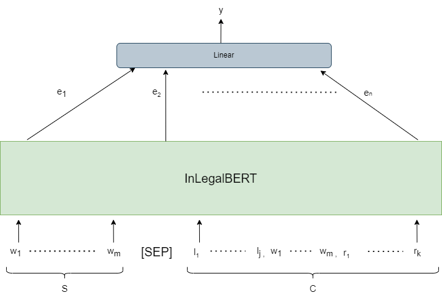
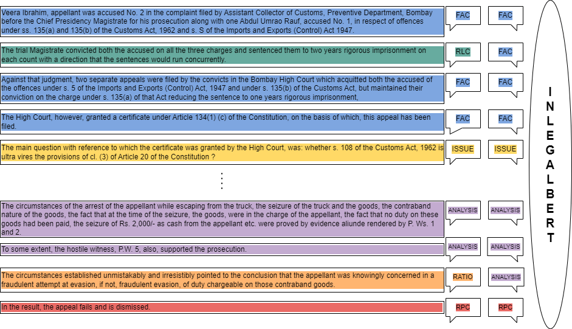
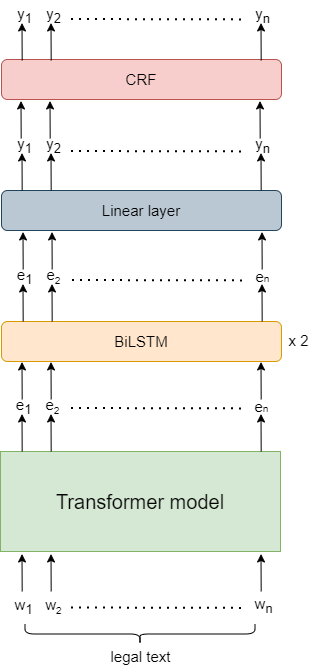
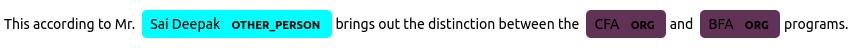

# LegalEval

Authors:
- [Yuri Noviello](https://github.com/yurinoviello)
- [Enrico Pallotta](https://github.com/PallottaEnrico)
- [Flavio Pinzarrone](https://github.com/flaviopinzarrone)
- [Giuseppe Tanzi](https://github.com/giuseppe-tanzi)

Project work for the "Natural Language Processing" course of the Artificial Intelligence master's degree at University of Bologna. This code in this repository is a devolopment of the first two tasks of the [LegalEval challenge](https://sites.google.com/view/legaleval/home) of [SemEval 2023](https://semeval.github.io/SemEval2023/).  

The LegalEval challenge proposes three tasks, based on Indian Legal documents: 
- Rhetorical Roles prediction
- Legal Named Entity Recognition
- Court Judgement Prediction with Explanation. 

## Introduction

Our work focuses on the first two tasks. For the first task we present a context-aware approach to enhance sentence information. With the help of this approach, the classification model utilizing InLegalBert as a transformer achieved <b>81.12%</b> Micro-F1. For the second task we present a NER approach to extract and classify entities like names of petitioner, respondent, court or statute from a given document. The model utilizing XLNet as transformer and a dependency parser on top achieved <b>87.43%</b> F1.

## Task A

The objective of the task is to segment a given legal document by predicting the rhetorical role label for each sentence such as a preamble, fact, ratio, arguments, etc. These are referred to as Rhetorical Roles (RR). This segmentation is a fundamental building block for many legal AI applications like judgment summarizing, judgment outcome prediction, precedent search, etc.

### Best model architecture

    

  Context aware InLegalBERT

### Output Example

    

      Example of a segmented document

### Results

|  	|  	| **Validation Set** 	|  	|  	| **Test Set** 	|  	|
|:---:	|:---:	|:---:	|:---:	|:---:	|:---:	|:---:	|
| **Models** 	| **Weighted  Precision** 	| **Weighted Recall** 	| **Micro F1** 	| **Weighted  Precision** 	| **Weighted  Recall** 	| **Micro  F1** 	|
| Context Aware Legal-RoBERTa 	| 77.0 	| 76.0 	| 76.0 	| 79.0 	| 80.0 	| 80.0 	|
| Context Aware InLegalBERT 	| 77.0 	| 77.0 	| 78.0 	| 81.0 	| 82.0 	| 82.0 	|

## Task B

The objective of the task is to extract legal named entities from court judgment texts to effectively generate metadata information that can be exploited for many legal applications like knowledge graph creation, co-reference resolution and in general to build any query-able knowledge base that would allow faster information access.

### Best model architecture

    

  Transformer + BiLSTM + CRF

### Output Example

    

  Example of Legal Named Entities detected in a sentence

### Results

|  	|  	| **Validation Set** 	|  	|  	| **Test Set** 	|  	|
|:---:	|:---:	|:---:	|:---:	|:---:	|:---:	|:---:	|
| **Models** 	| **Macro  Precision** 	| **Macro Recall** 	| **Macro F1** 	| **Macro  Precision** 	| **Macro  Recall** 	| **Macro  F1** 	|
| RoBERTa - BiLSTM - CRF 	| 81.2 	| 86.5 	| 84.1 	| 84.4 	| 89.0 	| 86.7 	|
| XLNet - BiLSTM - CRF 	| 85.3 	| 86.8 	| 84.0 	| 85.9 	| 90.4 	| 88.1 	|

## References
- [LegalEval challenge leaderboard](https://codalab.lisn.upsaclay.fr/competitions/9558#results)
